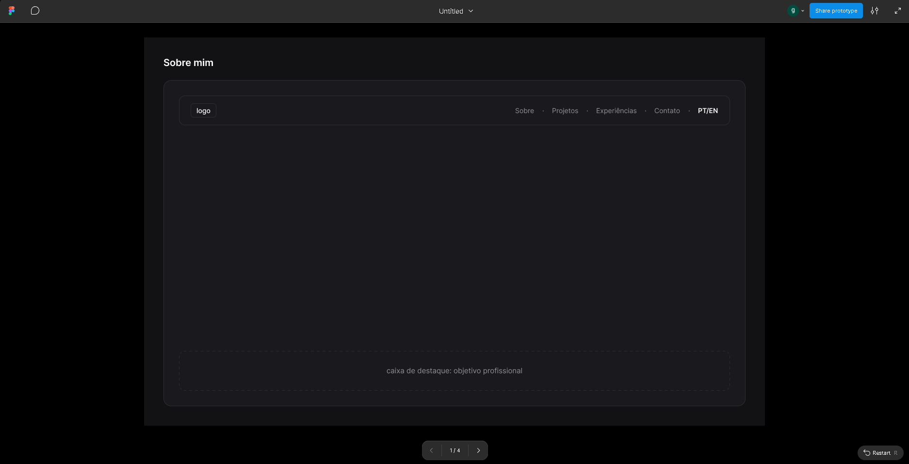
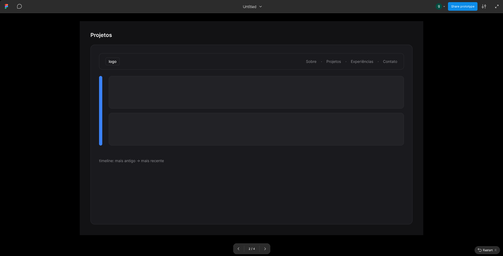
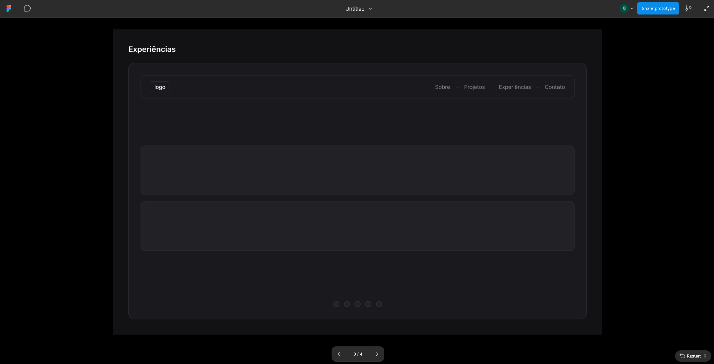
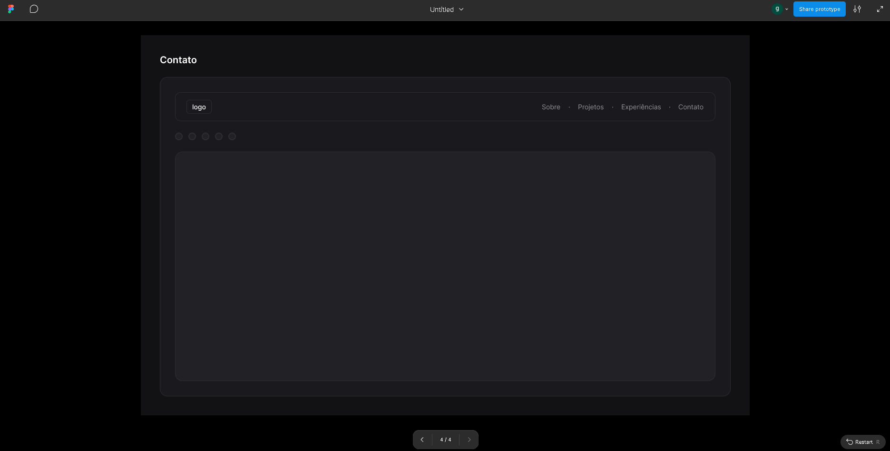

# Portfólio — Gustavo Lima Dias

Website de portfólio profissional desenvolvido para o **Laboratório 1** da disciplina
Projeto de Software (PUC Minas — Engenharia de Software, 2º semestre/2026).

## Sobre o projeto

Portfólio pessoal para apresentar minha trajetória, habilidades, projetos e formas
de contato. A identidade visual é inspirada em painéis de controle industrial (HMI),
fazendo referência direta à minha área de atuação: desenvolvimento backend e
integração de sistemas industriais (estágio na Vallourec).

Seções previstas (conforme especificação do laboratório):

- **Sobre Mim** — apresentação em português e inglês (com toggle de idioma)
- **Projetos** — linha do tempo de projetos, do mais antigo ao mais recente
- **Experiências** — trajetória profissional e acadêmica
- **Contato** — ícones para e-mail, WhatsApp e LinkedIn, além de formulário de contato

## Wireframes (Figma — média fidelidade)

Protótipos de baixa/média fidelidade das 4 páginas, feitos no Figma antes da
implementação em código:

| Sobre Mim | Projetos |
|---|---|
|  |  |

| Experiências | Contato |
|---|---|
|  |  |

🔗 Link do arquivo no Figma: https://www.figma.com/proto/E75sF3iSngiUkqNMIaz3Pr/Untitled?node-id=0-1&t=knZ4hX3ciSFSmovz-1

## Tecnologias previstas / utilizadas

- [React](https://react.dev/) 18
- [Vite](https://vitejs.dev/) — build tool e servidor de desenvolvimento
- [React Router](https://reactrouter.com/) — navegação entre páginas
- [Material UI (MUI)](https://mui.com/material-ui/) — biblioteca de componentes
- [IBM Plex Mono / IBM Plex Sans](https://fonts.google.com/specimen/IBM+Plex+Mono) — tipografia (Google Fonts)

## Dependências e bibliotecas

| Pacote | Uso |
|---|---|
| `react`, `react-dom` | Biblioteca principal da interface |
| `react-router-dom` | Roteamento entre as páginas (Sobre, Projetos, Experiências, Contato) |
| `@mui/material`, `@mui/icons-material` | Componentes de UI e ícones |
| `@emotion/react`, `@emotion/styled` | Motor de estilização usado pelo MUI |
| `vite`, `@vitejs/plugin-react` | Ferramenta de build e dev server |

## Estrutura de diretórios

```
portfolio-gustavo/
├── public/
│   └── favicon.svg
├── src/
│   ├── components/
│   │   ├── Header.jsx          # Navegação principal + toggle de idioma
│   │   ├── Footer.jsx          # Rodapé com links sociais
│   │   ├── Layout.jsx          # Layout base (header + conteúdo + footer)
│   │   └── SystemStatusBar.jsx # Barra de status (elemento visual de assinatura)
│   ├── context/
│   │   └── LanguageContext.jsx # Contexto global de idioma (PT/EN)
│   ├── data/
│   │   ├── projects.js         # Dados dos projetos (editar aqui)
│   │   └── experience.js       # Dados das experiências (editar aqui)
│   ├── pages/
│   │   ├── About.jsx
│   │   ├── Projects.jsx
│   │   ├── Experience.jsx
│   │   └── Contact.jsx
│   ├── App.jsx                 # Definição das rotas
│   ├── main.jsx                # Ponto de entrada
│   ├── theme.js                # Tema MUI (paleta e tipografia customizadas)
│   └── index.css               # Estilos globais
├── index.html
├── package.json
└── vite.config.js
```

## Instruções de instalação e execução local

Pré-requisitos: [Node.js](https://nodejs.org/) 18+ instalado.

```bash
# 1. Clonar o repositório
git clone https://github.com/GustavoLimaDias/Laborat-rio-de-desenvolvimento-de-software.git
cd Laborat-rio-de-desenvolvimento-de-software

# 2. Instalar as dependências
npm install

# 3. Rodar em modo desenvolvimento
npm run dev

# 4. Gerar build de produção
npm run build
npm run preview
```

O projeto abrirá em `http://localhost:5173` por padrão.

## Autor

**Gustavo Lima Dias**
Estudante de Engenharia de Software — PUC Minas
